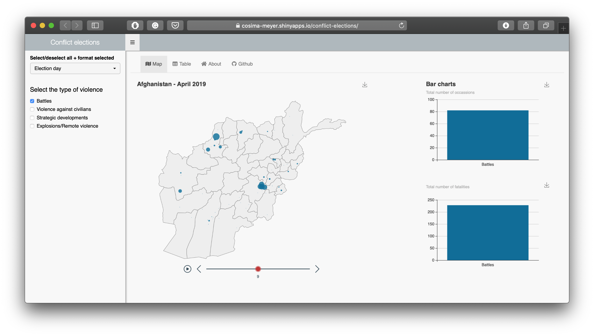

# ShinyApp: Conflict Elections in Afghanistan in 2019

[](https://cosima-meyer.shinyapps.io/conflict-elections/)

You can access the ShinyApp [here](https://cosima-meyer.shinyapps.io/conflict-elections/).

This project is a spin-off of a co-authored publication with [Dennis Hammerschmidt](https://github.com/dennis-hammerschmidt) that [analyzes patterns of violence during conflict elections in Afghanistan](https://www.ceeol.com/search/article-detail?id=775100) in 2005.

While the geo-spatially disaggregated data for the original publication is based on [UCDP data](https://ucdp.uu.se), this ShinyApp is based on [ACLED data](https://acleddata.com/#/dashboard) and shows how violence that includes the Taliban develops starting 180 days up to the election in 2019.


This repository contains: 
```
├── README.md
├── app.R
├── code
│   ├── data.R
│   ├── helper.R
│   └── theme_custom.R
├── conflict-elections.Rproj
├── data
│   ├── 1900-01-01-2020-03-22-Afghanistan.csv
│   └── data.RData
├── figures
│   └── shinyapp-conflict.png
├── markdown
│   ├── about.md
│   └── git.md
└── material_OODM_CorrelAid
    ├── example_ShinyApp
    │   └── app.R
    └── example_ShinyApp_shinydashboard
        └── app.R
```

You can access the **slides from the OODM 2020 at CorrelAid [here](https://cosimameyer.rbind.io/slides/interactive-science/correlaid#1)**.


⚡ [Blog post about how to make your app faster](https://appsilon.com/r-shiny-faster-updateinput-css-javascript/)
